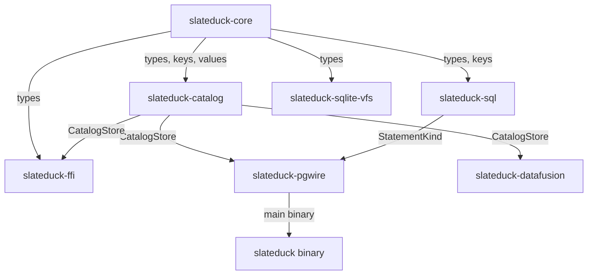

# Crate Structure

SlateDuck is organized as a Rust workspace with seven crates, each with a distinct responsibility and clear dependency boundaries. This structure enforces separation of concerns at the compilation level: a crate cannot accidentally depend on another crate's internals without an explicit dependency declaration in `Cargo.toml`.

## Workspace Layout

## slateduck-core

**Role:** Foundation types shared across all other crates.

**Key contents:**
- `tags.rs` — The tag registry defining all 28 DuckLake catalog tables plus internal tables. This is the single source of truth for tag allocation, key shapes, MVCC behavior, and status.
- `keys.rs` — Binary key encoding functions. All keys are constructed here to ensure consistent encoding across the codebase.
- `values.rs` — Value envelope encoding (magic bytes, version prefix, protobuf serialization).
- `rows.rs` — Protobuf message definitions for all row types (SnapshotRow, TableRow, ColumnRow, DataFileRow, etc.).
- `mvcc.rs` — MVCC visibility functions (is_visible, latest_visible_version, GC eligibility).
- `counters.rs` — Counter domains and allocation logic for snapshot IDs, catalog IDs, and file IDs.
- `types.rs` — DuckLake type system mapping and type-aware statistical comparisons for predicate pushdown.
- `path.rs` — Path canonicalization for resolving data file paths relative to catalog or data prefixes.
- `validation.rs` — Integration tests validating assumptions about SlateDB's API behavior.

**Dependencies:** `prost` (protobuf), `thiserror` (error types). Notably, this crate does NOT depend on SlateDB or any async runtime. It is pure data types and logic.

## slateduck-catalog

**Role:** The core catalog persistence layer. Manages the SlateDB database, handles writes, reads, garbage collection, excision, export, repair, verification, and metrics.

**Key contents:**
- `store.rs` — `CatalogStore`: the main entry point. Opens the catalog, registers the writer epoch, provides read and write handles.
- `init.rs` — Safe concurrent initialization using serializable snapshot transactions.
- `writer.rs` — `CatalogWriter`: all catalog mutation operations (create schema, add column, register data file, etc.).
- `reader.rs` — `CatalogReader`: snapshot-bound read operations with MVCC filtering and file pruning.
- `gc.rs` — Visibility garbage collection: planning and applying retention horizon changes.
- `excise.rs` — Physical deletion of superseded rows, with safety checks and audit logging.
- `checkpoint.rs` — Checkpoint creation and restoration for point-in-time recovery.
- `export.rs` — NDJSON export/import for catalog backup and migration.
- `repair.rs` — Conservative repair: fixes orphaned rows and stale counters, refuses on unrecoverable corruption.
- `verify.rs` — Integrity verification: checks format version, counter consistency, MVCC invariants.
- `audit.rs` — Audit log management: writing and reading audit entries per snapshot.
- `metrics.rs` — Prometheus-compatible metrics: operation counts, latencies, resource usage.
- `partition.rs` — `CatalogRegistry` and `PartitionedWriter` for multi-writer via dataset partitioning.
- `encryption.rs` — AES-256 encryption configuration for at-rest encryption via SlateDB block transformers.
- `performance.rs` — Hot key optimization, secondary indexes, packed metadata for cold-start performance.
- `cleanup.rs` — Orphaned Parquet file detection and optional deletion.

**Dependencies:** `slateduck-core`, `slatedb`, `object_store`, `tokio`, `prost`, `serde_json`, `chrono`.

## slateduck-sql

**Role:** Bounded SQL classification. Parses SQL strings and maps them to structured `StatementKind` enum variants.

**Key contents:**
- `classifier.rs` — The main classification logic: ~50 match arms covering all supported DuckLake SQL patterns.
- `lib.rs` — Public API: `classify_statement(sql) -> Result<StatementKind>`.

**Dependencies:** `slateduck-core` (for types), `sqlparser` (SQL parsing). Does NOT depend on `slateduck-catalog` — classification is purely syntactic, not semantic.

## slateduck-pgwire

**Role:** PostgreSQL wire protocol server. Accepts DuckDB connections, manages sessions, and dispatches classified SQL to the catalog store.

**Key contents:**
- `server.rs` — TCP accept loop with TLS and session limiting.
- `handler.rs` — Protocol handler implementing `SimpleQueryHandler` and `ExtendedQueryHandler`.
- `executor.rs` — Statement execution: maps `StatementKind` to catalog operations and constructs PG wire result sets.
- `session.rs` — Per-connection state: transaction buffering, settings, pending operations.
- `types.rs` — PostgreSQL type OID mapping.
- `error.rs` — SQLSTATE error mapping from internal errors to PostgreSQL error responses.
- `main.rs` — Binary entry point: CLI argument parsing, configuration loading, server startup.

**Dependencies:** `slateduck-core`, `slateduck-catalog`, `slateduck-sql`, `pgwire`, `tokio`, `tokio-rustls`.

## slateduck-datafusion

**Role:** Apache DataFusion integration. Exposes SlateDuck catalogs as DataFusion catalog/schema/table providers.

**Key contents:**
- `catalog_provider.rs` — `SlateDuckCatalogProvider`, `SlateDuckSchemaProvider`, `SlateDuckTableProvider`: maps DuckLake types to Arrow DataTypes and exposes table schemas to DataFusion's query planner.

**Dependencies:** `slateduck-core`, `slateduck-catalog`, `datafusion`, `arrow`.

## slateduck-ffi

**Role:** C/C++ foreign function interface for the native DuckDB extension (Strategy C). Exposes catalog operations as `extern "C"` functions with opaque handles and C-compatible structs.

**Key contents:**
- `lib.rs` — Complete FFI surface: `slateduck_open`, `slateduck_close`, `slateduck_list_schemas`, `slateduck_list_tables`, `slateduck_describe_table`, `slateduck_list_data_files`, plus error handling and memory management.

**Dependencies:** `slateduck-core`, `slateduck-catalog`, `tokio` (for async bridge).

## slateduck-sqlite-vfs

**Role:** SQLite VFS (Virtual File System) implementation for potential SQLite compatibility layer. Currently experimental.

**Dependencies:** `slateduck-core`.

## Dependency Rules

The crates follow strict layering rules:

1. `slateduck-core` depends on nothing workspace-internal (it's the leaf)
2. `slateduck-catalog` depends only on `slateduck-core`
3. `slateduck-sql` depends only on `slateduck-core`
4. Higher-level crates (`pgwire`, `datafusion`, `ffi`) depend on `core`, `catalog`, and optionally `sql`
5. No circular dependencies are possible (enforced by Cargo)

This layering means you can use `slateduck-core` and `slateduck-catalog` in a custom application without pulling in the PG wire server, DataFusion, or FFI code.
