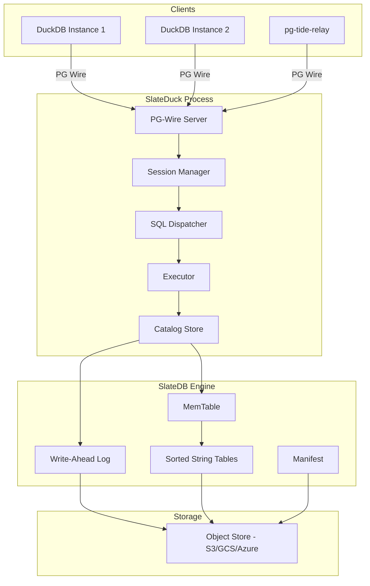

# Architecture Overview

SlateDuck is a bridge between DuckDB's DuckLake catalog protocol and SlateDB's cloud-native key-value storage. It accepts connections from DuckDB (speaking the PostgreSQL wire protocol), translates catalog SQL into key-value operations, and persists catalog state to object storage through SlateDB's LSM-tree engine. This page describes the system at a high level: its components, data flows, and deployment topology.

## System Components

The architecture is layered with clear boundaries between concerns:

**PG-Wire Server** accepts TCP connections, handles TLS termination, performs optional password authentication, and manages connection lifecycles. It uses the `pgwire` crate to implement the PostgreSQL frontend/backend protocol, including startup negotiation, simple query mode, and extended query mode with prepared statements and parameter binding.

**Session Manager** maintains per-connection state: transaction status (idle, in transaction, or failed), buffered operations for the current transaction, session variables (timezone, encoding, application name), and the current snapshot binding.

**SQL Dispatcher** parses incoming SQL using `sqlparser-rs` and classifies it into one of approximately 50 known statement kinds. This is a pure transformation with no side effects: it maps a SQL string to a structured enum variant with extracted parameters.

**Executor** takes the classified statement and performs the corresponding catalog operation. For reads, this means acquiring a `CatalogReader` bound to the appropriate snapshot and executing prefix scans or point lookups. For writes, this means buffering operations in the session's pending transaction or executing them immediately (for auto-commit mode).

**Catalog Store** is the core persistence layer. It manages the SlateDB database handle, counter allocation (for snapshot IDs, catalog IDs, file IDs), writer epoch fencing, and the read/write interface. It exposes `CatalogReader` for snapshot-bound reads and `CatalogWriter` for atomic mutations.

## Data Flow: Read Path

When DuckDB executes a query and needs to know which Parquet files to scan:

1. DuckDB sends `SELECT * FROM ducklake_data_file WHERE table_id = 42` over the PG wire protocol
2. PG-Wire Server decodes the wire message and passes the SQL string to the session's query handler
3. SQL Dispatcher classifies this as `SelectDataFiles { table_id: 42 }`
4. Executor creates a `CatalogReader` bound to the session's current snapshot
5. CatalogReader executes a prefix scan on `0x0B | table_id(42)` in SlateDB
6. For each matching key-value pair, the value is decoded from protobuf into a `DataFileRow`
7. MVCC filter checks `begin_snapshot <= current_snapshot` for each row (data files are append-only, no end_snapshot check)
8. Visible rows are encoded as PG-wire DataRow messages and sent back to DuckDB

The entire read path is lock-free (no mutex acquisition for readers) and touches only the keys with the relevant prefix (no full table scan).

## Data Flow: Write Path

When DuckDB registers a new Parquet file:

1. DuckDB sends `BEGIN`, then `INSERT INTO ducklake_data_file (...)`, then more INSERTs, then `INSERT INTO ducklake_snapshot`, then `COMMIT`
2. Each INSERT is classified by the SQL Dispatcher and buffered in the session's `PendingCatalogTxn`
3. On `COMMIT`, the executor:
   a. Acquires the catalog mutex (single-writer)
   b. Checks the writer epoch (fencing guard)
   c. Allocates a new snapshot ID from the counter system
   d. Creates a `CatalogWriter` and applies all buffered operations
   e. Each operation encodes its row as protobuf, wraps it in the value envelope, constructs the key, and adds it to a SlateDB `WriteBatch`
   f. The batch is committed atomically (single WAL PUT to object storage)
   g. Releases the catalog mutex

4. The committed transaction is now durable and visible to all readers

## Deployment Topology

SlateDuck is designed to run as a **single-instance sidecar** alongside your DuckDB processes. In a typical deployment:

- One SlateDuck process per catalog (the writer)
- Multiple DuckDB instances connecting to it (the readers, via PG wire)
- Object storage as the shared durable layer

For high availability, you can run a standby SlateDuck instance that monitors the writer's health. If the writer fails, the standby promotes itself (incrementing the writer epoch). This is manual or operator-scripted — SlateDuck does not include built-in leader election.

## Alternative Deployment: Native Extension

Instead of a network sidecar, SlateDuck can be loaded directly into DuckDB's process as a native extension (via the FFI crate). This eliminates network round-trips between DuckDB and SlateDuck, reducing catalog operation latency to microseconds. The trade-off is tighter coupling: the extension shares DuckDB's process lifecycle and crash domain.

## Alternative Deployment: DataFusion Integration

For Rust applications using Apache DataFusion, SlateDuck provides a `CatalogProvider` that exposes the catalog as DataFusion table sources. This enables query planning against SlateDuck-managed tables without DuckDB in the picture.
