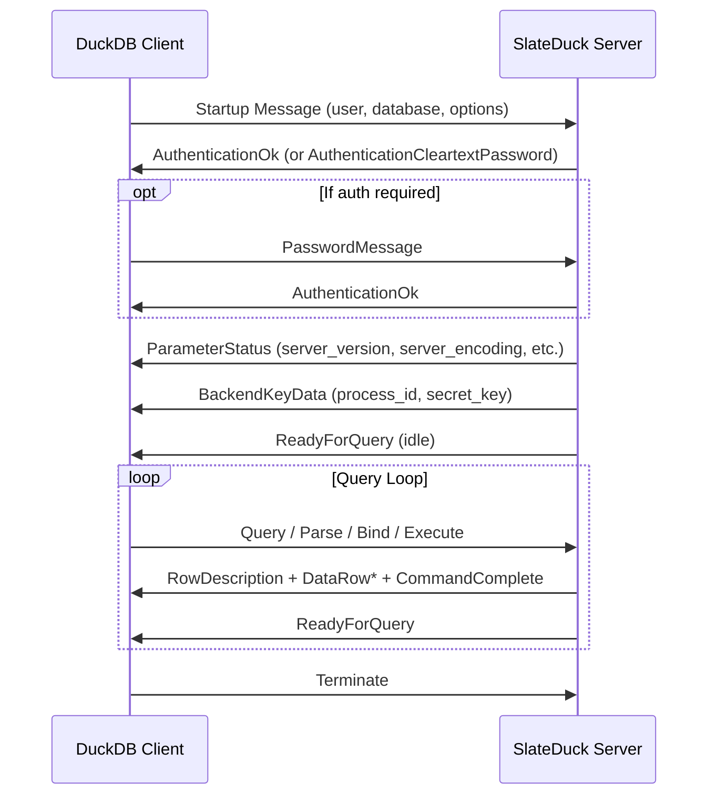

# PG-Wire Protocol

SlateDuck implements a subset of the PostgreSQL wire protocol (v3) sufficient to serve DuckDB's `ducklake` extension. The implementation uses the `pgwire` crate for protocol framing and message types, with custom handlers for authentication, query execution, and result encoding. This page describes the protocol flow, supported features, and limitations.

## Connection Lifecycle



## Authentication

SlateDuck supports two authentication modes:

**No authentication (default):** The server sends `AuthenticationOk` immediately after receiving the Startup message. Suitable for local development and environments where network-level access control provides sufficient security.

**Cleartext password:** The server sends `AuthenticationCleartextPassword`, the client responds with a `PasswordMessage`, and the server verifies against the configured credentials. This is combined with TLS in production to prevent password sniffing.

The `ServerConfig` struct controls authentication:
```
auth:
  username: "ducklake"    # Optional; if set, must match startup user
  password: "secret123"   # Optional; if set, triggers password auth
```

## Query Modes

SlateDuck implements both PostgreSQL query modes:

### Simple Query Mode

The client sends a `Query` message containing a complete SQL string. SlateDuck parses it, classifies it, executes it, and returns the results as `RowDescription` + `DataRow` messages followed by `CommandComplete`. Multiple statements separated by semicolons are supported (executed sequentially within the same message).

### Extended Query Mode

The client sends a sequence of `Parse` (prepare a statement), `Bind` (provide parameter values), `Describe` (get result column info), and `Execute` (run the statement) messages. SlateDuck supports this mode because DuckDB uses it for parameterized queries (data file registrations, column insertions, etc.).

The extended query flow:
1. `Parse` — SlateDuck stores the SQL string (no actual preparation needed since classification is cheap)
2. `Bind` — Parameter values are captured into a `ParamValues` struct
3. `Describe` — Returns `RowDescription` based on the classified statement kind
4. `Execute` — Classifies the SQL with bound parameters and executes against the catalog

## Type System

SlateDuck maps DuckLake types to PostgreSQL OIDs for wire protocol encoding:

| PostgreSQL Type | OID | Used For |
|----------------|-----|----------|
| int8 (bigint) | 20 | IDs, counters, row counts |
| int4 (integer) | 23 | Column indexes, small counts |
| text | 25 | Names, paths, types, JSON |
| bool | 16 | Flags (is_nullable, etc.) |
| float8 | 701 | Statistics (min/max for numeric columns) |
| timestamp | 1114 | Snapshot timestamps |
| uuid | 2950 | Generated UUIDs |

All values are transmitted in text format (not binary) to maximize compatibility. DuckDB's `ducklake` extension expects text-format responses.

## Session Variables

SlateDuck tracks per-session variables to satisfy DuckDB's protocol expectations:

- `timezone` — Defaults to "UTC"
- `client_encoding` — Defaults to "UTF8"
- `DateStyle` — Defaults to "ISO, MDY"
- `application_name` — Set by client on connection

These are stored in the `SessionSettings` struct and returned via `SHOW` statements.

## Connection Limits

The server enforces a configurable maximum number of concurrent sessions (default: 50). When the limit is reached, new connections are rejected with an appropriate error. This prevents resource exhaustion on the SlateDuck process. The limit is enforced via a Tokio semaphore in the accept loop.

Additionally, a maximum active scans limit (default: 25) prevents excessive concurrent prefix scans from overwhelming the SlateDB engine.

## TLS Support

SlateDuck supports TLS via `tokio-rustls`. When TLS is configured, the server handles the SSLRequest negotiation:

1. Client sends `SSLRequest` (a special 8-byte message)
2. Server responds with 'S' (willing to SSL) or 'N' (not available)
3. If 'S', the client initiates a TLS handshake
4. After handshake, normal startup negotiation proceeds over the encrypted connection

TLS configuration requires a certificate file and private key file in PEM format.

## Error Handling

Errors are mapped to PostgreSQL SQLSTATE codes for client compatibility:

| Internal Error | SQLSTATE | Meaning |
|---------------|----------|---------|
| WriterFenced | 57P04 | Another writer has taken over |
| NotFound | 02000 | No data (empty result) |
| Duplicate | 23505 | Unique violation |
| Unsupported | 0A000 | Feature not supported |
| BatchTooLarge | 54001 | Transaction exceeds 64 MiB |
| ObjectStore | 08006 | Connection to storage failed |
| Corruption | XX001 | Data corruption detected |

Errors are sent as `ErrorResponse` messages with severity, SQLSTATE code, and a human-readable message.
