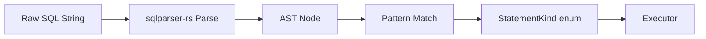

# SQL Dispatcher

The SQL dispatcher is the translation layer between raw SQL strings (arriving over the PostgreSQL wire protocol) and structured catalog operations. It parses SQL using `sqlparser-rs`, matches the resulting AST against known DuckLake patterns, and produces a `StatementKind` enum variant that the executor can handle directly. The dispatcher is intentionally bounded: it recognizes a finite set of statement shapes and rejects everything else.

## Classification Pipeline

The pipeline has three stages:

1. **Parsing:** The raw SQL string is parsed using `sqlparser-rs` with the PostgreSQL dialect. This produces a structured AST representation. Parse errors are returned as `SqlDispatchError::ParseError`.

2. **Classification:** The AST is matched against known patterns. Each pattern checks the structure of the AST (which tables are referenced, what columns are selected, what the WHERE clause looks like) to identify the specific DuckLake operation being requested.

3. **Parameter extraction:** Once the pattern is identified, relevant values are extracted from the AST: table IDs, schema IDs, column names, file paths, etc. These become the fields of the `StatementKind` variant.

## Statement Kinds

The complete bounded set of recognized statements, organized by category:

### Session Management
- `SelectVersion` — `SELECT version()` (returns "PostgreSQL 15.0 (SlateDuck)")
- `SelectCurrentSchema` — `SELECT current_schema` (returns "public")
- `SelectCurrentDatabase` — `SELECT current_database()` (returns "ducklake")
- `SelectPgType` — Queries against `pg_type` for OID resolution
- `ShowVariable(name)` — `SHOW timezone`, `SHOW client_encoding`, etc.
- `SetVariable(name, value)` — `SET timezone = 'UTC'`, etc.

### Transaction Control
- `Begin` — `BEGIN` or `START TRANSACTION`
- `Commit` — `COMMIT` or `END`
- `Rollback` — `ROLLBACK` or `ABORT`

### Catalog Reads (approximately 20 variants)
- `SelectMaxSnapshot` — `SELECT MAX(snapshot_id) FROM ducklake_snapshot`
- `SelectSchemas` — `SELECT * FROM ducklake_schema WHERE ...`
- `SelectTables` — `SELECT * FROM ducklake_table WHERE schema_id = ?`
- `SelectColumns` — `SELECT * FROM ducklake_column WHERE table_id = ?`
- `SelectDataFiles` — `SELECT * FROM ducklake_data_file WHERE table_id = ?`
- `SelectFileColumnStats` — Statistics for predicate pushdown
- And many more (views, macros, metadata, inlined data, snapshots)

### Catalog Writes (approximately 15 variants)
- `InsertSchema` — `INSERT INTO ducklake_schema (...) VALUES (...)`
- `InsertTable` — `INSERT INTO ducklake_table (...) VALUES (...)`
- `InsertColumn` — `INSERT INTO ducklake_column (...) VALUES (...)`
- `InsertDataFile` — `INSERT INTO ducklake_data_file (...) VALUES (...)`
- `InsertSnapshot` — `INSERT INTO ducklake_snapshot (...) VALUES (...)`
- And more (delete files, stats, metadata, views, macros)

### Updates
- `UpdateEndSnapshot(table_name)` — `UPDATE ducklake_X SET end_snapshot = ? WHERE ...`
- `UpdateTableStats` — `UPDATE ducklake_table_stats SET ...`

## How Pattern Matching Works

The classifier examines the AST structure systematically. For a SELECT statement, it checks:

1. Is the FROM clause referencing a known DuckLake table (ducklake_schema, ducklake_table, etc.)?
2. Does the SELECT list match the expected columns for that table?
3. Does the WHERE clause match a known filter pattern (e.g., `WHERE table_id = $1`)?

For an INSERT statement, it checks:

1. Is the target table a known DuckLake table?
2. Do the column names in the INSERT match the expected schema?
3. Are the values extractable as parameters?

If all checks pass, the statement is classified as the corresponding `StatementKind`. If any check fails, or if the statement does not match any known pattern, it is classified as `Unsupported`.

## Parameter Handling

DuckDB uses both simple query mode (parameters embedded in SQL text) and extended query mode (prepared statements with `$1`, `$2` parameter placeholders). The classifier handles both:

- In simple query mode, literal values are extracted directly from the AST.
- In extended query mode, parameter placeholders are matched positionally, and the actual values are provided separately in the `ParamValues` struct.

The `ParamValues` struct provides typed accessors (`get_u64`, `get_string`, `get_bool`, `get_optional_string`) that handle the conversion from wire-format strings to the expected types. Type mismatches are reported as `SqlDispatchError::TypeMismatch`.

## Security Properties

The bounded nature of the dispatcher provides strong security guarantees:

- **No SQL injection:** Because the dispatcher matches on AST structure (not string patterns), there is no way to inject additional SQL through crafted input. A malicious value in a WHERE clause is just a value node in the AST.
- **No information disclosure:** Unsupported queries are rejected before any data is accessed. You cannot probe the catalog through creative SQL.
- **No privilege escalation:** The dispatcher does not support dynamic SQL, function calls (other than `version()` and `gen_random_uuid()`), or system table access beyond `pg_type`.
- **Auditable surface:** The complete set of supported statements fits on one screen. An auditor can verify that no dangerous operations are possible.

## Extending the Dispatcher

When a new version of DuckDB's `ducklake` extension introduces new SQL patterns, the dispatcher must be updated. The process is:

1. Capture the new SQL patterns from DuckDB's wire corpus (recorded sessions)
2. Add new variants to the `StatementKind` enum
3. Add new match arms in the classifier
4. Add new handlers in the executor
5. Add tests for the new patterns

This explicit process ensures that compatibility is deliberate and testable.
