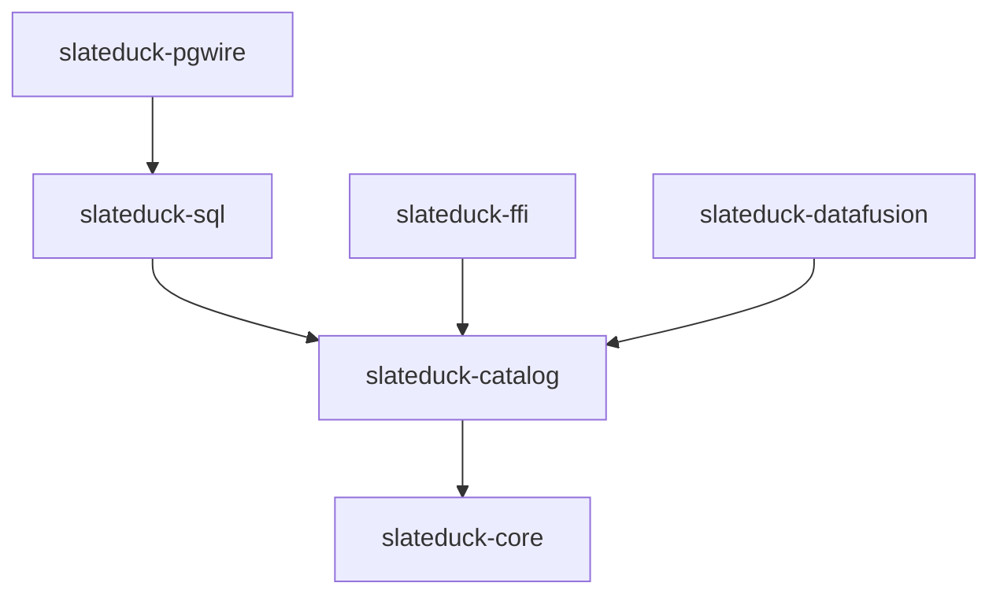

# Architecture Guide for Contributors

This page explains how the SlateDuck codebase is organized, what each module does, and where to make changes for common types of contributions. It is written for someone who has just cloned the repository and needs to orient themselves quickly.

## Dependency Graph

Information flows from top (network layer) to bottom (persistence layer). Each crate depends only on crates below it, never on peers or ancestors.

## Where to Make Changes

### Adding a new DuckLake SQL statement

1. Add the statement pattern to the wire corpus: `tests/fixtures/wire-corpus/`
2. Add a new variant to `StatementKind` in `crates/slateduck-sql/src/classifier.rs`
3. Add classification logic (pattern matching) in the classifier
4. Add an executor arm in `crates/slateduck-pgwire/src/executor.rs`
5. Implement the catalog operation in `crates/slateduck-catalog/src/`

### Adding a new catalog table (tag)

1. Allocate a tag byte in `crates/slateduck-core/src/tags.rs`
2. Define the row struct in `crates/slateduck-core/src/rows.rs` (with prost derives)
3. Add key encoding in `crates/slateduck-core/src/keys.rs`
4. Add read/write operations in `crates/slateduck-catalog/src/reader.rs` and `writer.rs`

### Fixing a wire protocol bug

1. Check `crates/slateduck-pgwire/src/handler.rs` for message handling
2. Check `crates/slateduck-pgwire/src/session.rs` for session state
3. Add a regression test in `crates/slateduck-pgwire/tests/integration_tests.rs`

### Improving performance

1. Add a benchmark in `crates/slateduck-catalog/benches/catalog_bench.rs`
2. Profile with `cargo bench` to identify the bottleneck
3. Common optimization points: `crates/slateduck-catalog/src/performance.rs` (hot key, secondary index)

## Key Design Principles

When contributing, keep these principles in mind:

- **No panics in library code.** Return `Result` types. Reserve `unwrap()` for cases where failure is provably impossible.
- **No unnecessary allocations in the read path.** Keys are encoded into stack buffers. Values are decoded in place.
- **Keep the SQL surface bounded.** Do not add support for arbitrary SQL. Every new statement must correspond to an actual DuckDB ducklake pattern.
- **Tests before implementation.** Write the test (or wire corpus entry) first, verify it fails, then implement.
