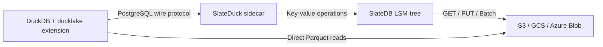

# What is SlateDuck?

SlateDuck is a **DuckLake catalog store** that eliminates the need for a separate database server to track your lakehouse metadata. It implements the same catalog protocol that DuckDB's `ducklake` extension expects, but instead of storing metadata in PostgreSQL or SQLite, it persists everything to object storage through SlateDB, an LSM-tree key-value store designed for cloud-native workloads.

## The Problem SlateDuck Solves

DuckLake is an open lakehouse format created by the DuckDB team. It stores analytical data as Parquet files and manages metadata (schemas, tables, columns, file registrations, statistics) in a catalog. The catalog is the brain of the lakehouse: it knows which Parquet files belong to which table, what columns exist, what the min/max statistics are for predicate pushdown, and how the schema has evolved over time.

Out of the box, DuckLake supports two catalog backends. PostgreSQL gives you a production-grade transactional store, but it requires provisioning, patching, backing up, and monitoring a database server. SQLite gives you simplicity, but it requires a local filesystem with POSIX advisory locking, which rules out multi-node deployments and serverless functions. Neither option is ideal for architectures where you want your entire data platform to consist of nothing more than an object storage bucket and some ephemeral compute.

SlateDuck provides a third option. Your lakehouse metadata lives in the same bucket as your Parquet files. There is no database server to manage. There is no local filesystem to coordinate. You get infinite time travel (every catalog snapshot is preserved), horizontal read scale-out (unlimited concurrent readers with no coordination), and crash-safe atomic writes, all backed by the durability guarantees of S3, GCS, or Azure Blob Storage.

## How SlateDuck Works

At a high level, SlateDuck is a sidecar process that speaks the PostgreSQL wire protocol. DuckDB connects to it as if it were a PostgreSQL server, issues the specific SQL statements that the `ducklake` extension emits for catalog operations, and SlateDuck translates those into key-value operations against SlateDB.

The separation is clean: SlateDuck handles metadata, DuckDB handles data. When DuckDB needs to know which Parquet files to scan for a query, it asks SlateDuck. When it needs to read the actual rows, it goes directly to the object store. This means SlateDuck never sees your data, only the catalog that describes it.

## Key Properties

**Zero infrastructure.** SlateDuck is a single static binary. You point it at a bucket path and it opens (or creates) a catalog there. No provisioning, no schema migrations, no connection pooling, no vacuuming.

**Infinite time travel.** Every mutation to the catalog creates a new immutable snapshot. Old snapshots are never deleted unless you explicitly run garbage collection followed by excision. You can query the catalog as it existed at any point in history.

**Horizontal read scale-out.** Because catalog data is stored as immutable SST files in object storage, any number of readers can open the catalog concurrently. There is no replication lag because there is no replication: every reader sees the same durable state.

**Crash safety.** SlateDB guarantees that a write either completes atomically or does not happen. There is no partial state. If the process crashes mid-transaction, the next startup will see a consistent catalog.

**DuckLake compatibility.** SlateDuck supports exactly the SQL statement shapes that DuckDB's `ducklake` extension emits. It is a drop-in replacement for a PostgreSQL-backed DuckLake catalog, requiring only a connection string change.

## Deployment Strategies

SlateDuck offers three ways to integrate with your application:

1. **PG-Wire Sidecar (Strategy B):** A standalone process that listens for PostgreSQL connections. DuckDB connects to it like any PostgreSQL server. This is the simplest and most flexible deployment model.

2. **Native DuckDB Extension (Strategy C):** A shared library loaded directly into DuckDB's process. Eliminates network round-trips for the highest possible performance, at the cost of tighter coupling.

3. **DataFusion Integration:** For Rust applications using Apache DataFusion, SlateDuck provides a `CatalogProvider` implementation that exposes lakehouse tables as DataFusion table sources.

## What SlateDuck Is Not

SlateDuck is not a query engine. It does not execute analytical queries, perform joins, or scan Parquet files. It is strictly a metadata catalog that tells DuckDB where to find data and what schema it has.

SlateDuck is not a general-purpose database. Its SQL support is intentionally bounded to the exact statement shapes that DuckLake clients emit. You cannot run arbitrary SQL against it.

SlateDuck is not a distributed system. It uses a single-writer model for catalog mutations. If you need concurrent writers, you partition your data into multiple datasets, each with its own independent catalog.
